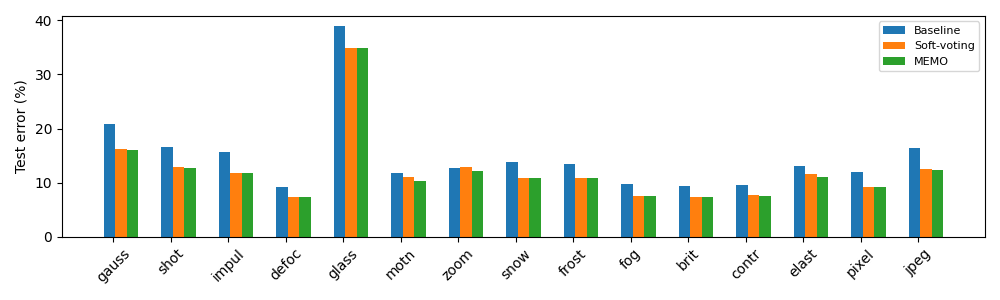
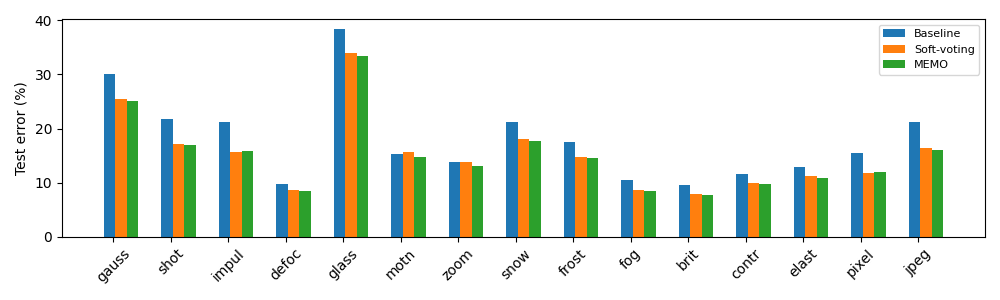
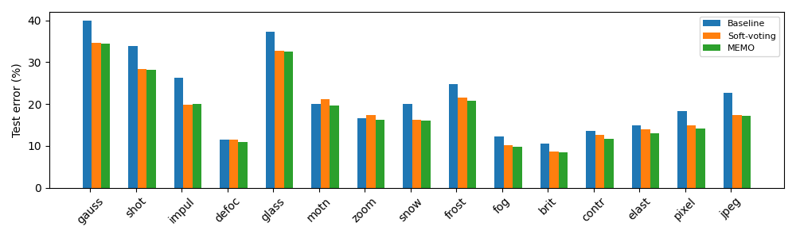
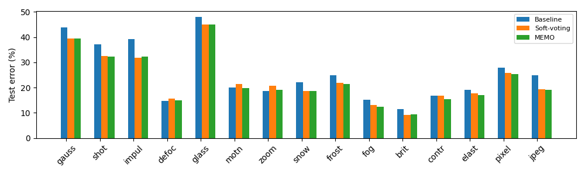
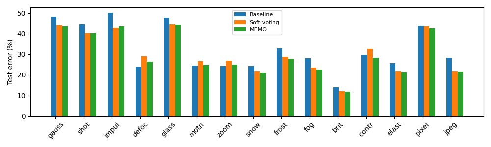

# Exploring the Similarity between MEMO and Soft-voting

<i>Mengying Lin, Yu Sun</i>

<b>Abstract: </b>
 

The <a href="https://arxiv.org/pdf/2110.09506.pdf">article</a> published in  NeurIPS'22 proposed a test time adaptation method called MEMO, which suggests feeding the model with the augmentations of one test point and then minimizing the entropy of marginal output over augmentations during optimization. This report aims to prove this method is actually equivalant to soft-voting both theoretically and empirically.

<b>Key Words: </b>
 

MEMO, soft-voting, Test Time adaptation;

## Theoretical analysis of MEMO

The loss of MEMO is defined as follows
$$
\ell(\theta;x)\triangleq H\left(\bar{p}_\theta(\cdot\vert x)\right)=-\sum_{y\in\mathcal{Y}}\bar{p}_\theta(y\vert x)\log\bar{p}_\theta(y\vert x) ,
$$
where $x$ is a single test point,  $\bar{p}_\theta(y\vert x)$ is the model's average predictions of the augmentations. To minimize the loss term,  the components of $\bar{p}_\theta(y\vert x)$ are expected to be driven to either 0 or 1, which indicates the model tends to predict uniformly and confidently if the augmented data are derived from the same data point. 

However, when we further examine how the final predictions will look like, it turns out MEMO makes no huge difference compared with soft-voting. 

Denote $\bar{p}_\theta(y\vert x)$ as $\{\bar{p}_{\theta 1}, ..., \bar{p}_{\theta n}\} $, where $\bar{p}_{\theta i}$ is the predicted average probability that $x$ belongs to class $i$. When implementing gradient decent using the loss function, the gradients over $\bar{p}_{\theta i}$ will be
$$
\frac{\partial \ell}{\partial \bar{p}_{\theta i}} = -log(\bar{p}_{\theta i}) - 1.
$$
According to the update rules,
$$
\bar{p}_{\theta i} \leftarrow \bar{p}_{\theta i} - \eta \frac{\partial \ell}{\partial \bar{p}_{\theta i}}.
$$
Those $\bar{p}_{\theta i}$ that are close to 1 will head towards 1 even closer with a even faster pace, which means we are actually averaging the predictions to obtain $\{ \bar{p}_{\theta i}\}$ and then trying to pick out the $i$ that maximize $\bar{p}_{\theta i}$, which is exactly what soft-voting will do. Hence, MEMO seems to be equivalent to soft-voting from a theoretical point of view.

## Empirical proof with experiments

To verify the equivalence between soft-voting and MEMO, a series of tests are carried out on Cifar10-C dataset, based on the “episodic” adaptation protocol (i.e. The model is reset after each test batch.) given in the article. To be consistent with the settings of the articles, batch size is set to 32, which means in exp2 and exp3 models will be adapted on 32 augmentations before testing for a single test point.

Exp1 is testing without any adaptations, which serves as a baseline. Exp2  is simply averaging the prediction during test time. Exp3 is implementing MEMO when testing.

The results results for CIFAR-10, CIFAR-10.1, and CIFAR-10-C are presented in the table, with full results for CIFAR-10-C attached in the appendix.

|           | CIFAR-10 | CIFAR-10.1 | CIFAR-10-C |
| --------- | -------- | ---------- | ---------- |
| ResNet-26 | 9.17     | 18.40      | 22.54      |
| + Avg     | 7.32     | 14.60      | 20.06      |
| + MEMO    | 7.25     | 14.60      | 19.55      |

It is clearly seen that averaging the predictions achieves similar accuracies compared with MEMO.

## Discussion

We have examined the similarity between MEMO and soft-voting in a both theoretical and empirical manner. They both favor results that are most confident in average when analyzing mathematically, and reduce the testing errors to resemble values when put into practice. However, MEMO seems to always outperform soft-voting slightly when tested on CIFAR-10-C, and the reasons behind are unclear yet.

Despite of  the less competitive performance over CIFAR-10-C, it is worth mentioning that soft-voting takes far shorter time than MEMO (9min vs 14min), and manage maintain relatively low testing errors at the same time, which means when there is a demand for faster inference, it is might be more effective to simply implement soft-voting than MEMO with “episodic” adaptation protocol.

At the same time, we should bear in mind soft-voting will not help if the model has a poor performance over augmentations. In the experiments the results see an improvement maybe because the model is pretrained on heavily augmented pictures, when tested on those augmented data it can get better results. It might be the same case for MEMO if the model is performing terribly over augmented data, leading to a decrease in accuracies, which demands further investigations.

 

 

## Appendix

### Results on CIFAR-10-C, level 1-5

In terms of testing time for each sub-dataset,  baseline takes approximately **30~40s**,  soft-voting takes  **8min 50s ~ 9min**,  and MEMO takes **14 min 30s ~ 15min.**

| | gauss | shot | impul | defoc | glass | motn | zoom | snow | frost | fog  | brit | contr | elast | pixel | jpeg |
| ----- | ----- | ---- | ----- | ----- | ----- | ---- | ---- | ---- | ----- | ---- | ---- | ----- | ----- | ----- | ---- |
| ResNet-26 | 20.75 | 16.50 | 15.75 | 9.20 | 38.89 | 11.75 | 12.78 | 13.89 | 13.89 | 9.74 | 9.39 | 9.56 | 13.08 | 11.98 | 16.39 |
| +SV | 16.27 | 12.90 | 11.72 | 7.37 | 34.89 | 11.07 | 12.80 | 10.87 | 10.92 | 7.51 | 7.69 | 7.69 | 11.64 | 9.23 | 12.56 |
| +MEMO | 16.05 | 12.79 | 11.75 | 7.36 | 34.94 | 10.27 | 12.08 | 10.86 | 10.78 | 7.54 | 7.45 | 7.45 | 11.02 | 9.24 | 12.37 |

    Table 1: Test error (%) on CIFAR-10-C level 1 corruptions

|           | gauss | shot  | impul | defoc | glass | motn  | zoom  | snow  | frost | fog   | brit | contr | elast | pixel | jpeg  |
| --------- | ----- | ----- | ----- | ----- | ----- | ----- | ----- | ----- | ----- | ----- | ---- | ----- | ----- | ----- | ----- |
| ResNet-26 | 30.14 | 21.79 | 21.15 | 9.66  | 38.34 | 15.28 | 13.84 | 21.16 | 17.57 | 10.54 | 9.65 | 11.62 | 12.92 | 15.40 | 21.26 |
| +SV       | 25.44 | 17.18 | 15.67 | 8.66  | 33.99 | 15.76 | 13.89 | 18.09 | 14.77 | 8.72  | 7.92 | 9.97  | 11.22 | 11.86 | 16.37 |
| +MEMO     | 25.14 | 16.91 | 15.88 | 8.44  | 33.99 | 14.79 | 13.10 | 17.66 | 14.57 | 8.53  | 7.72 | 9.69  | 10.81 | 11.98 | 16.10 |

    Table 2: Test error (%) on CIFAR-10-C level 2 corruptions

|           | gauss | shot  | impul | defoc | glass | motn  | zoom  | snow  | frost | fog   | brit  | contr | elast | pixel | jpeg  |
| --------- | ----- | ----- | ----- | ----- | ----- | ----- | ----- | ----- | ----- | ----- | ----- | ----- | ----- | ----- | ----- |
| ResNet-26 | 39.99 | 33.80 | 26.35 | 11.51 | 37.31 | 19.97 | 16.65 | 19.98 | 24.67 | 12.18 | 10.54 | 13.59 | 14.97 | 18.39 | 22.71 |
| +SV       | 34.57 | 28.28 | 19.80 | 11.49 | 32.80 | 21.14 | 17.33 | 16.20 | 21.52 | 10.15 | 8.65  | 12.68 | 13.99 | 14.83 | 17.40 |
| +MEMO     | 34.38 | 28.24 | 20.09 | 10.91 | 32.58 | 19.70 | 16.16 | 16.05 | 20.83 | 9.85  | 8.53  | 11.78 | 13.09 | 14.22 | 17.16 |

    Table 3: Test error (%) on CIFAR-10-C level 3 corruptions

|           | gauss | shot  | impul | defoc | glass | motn  | zoom  | snow  | frost | fog   | brit  | contr | elast | pixel | jpeg  |
| --------- | ----- | ----- | ----- | ----- | ----- | ----- | ----- | ----- | ----- | ----- | ----- | ----- | ----- | ----- | ----- |
| ResNet-26 | 48.03 | 37.17 | 39.29 | 14.82 | 48.03 | 19.94 | 18.69 | 22.03 | 24.89 | 15.13 | 11.43 | 16.81 | 19.06 | 27.92 | 24.91 |
| +SV       | 45.04 | 32.46 | 31.89 | 15.63 | 45.04 | 21.37 | 20.67 | 18.63 | 21.92 | 13.08 | 9.23  | 16.86 | 17.85 | 25.80 | 19.36 |
| +MEMO     | 44.91 | 32.18 | 32.21 | 14.90 | 44.91 | 19.83 | 19.11 | 18.73 | 21.34 | 12.37 | 9.47  | 15.40 | 16.98 | 25.39 | 19.17 |

    Table 4: Test error (%) on CIFAR-10-C level 4 corruptions

|           | gauss | shot  | impul | defoc | glass | motn  | zoom  | snow  | frost | fog   | brit  | contr | elast | pixel | jpeg  |
| --------- | ----- | ----- | ----- | ----- | ----- | ----- | ----- | ----- | ----- | ----- | ----- | ----- | ----- | ----- | ----- |
| ResNet-26 | 48.38 | 44.79 | 50.28 | 24.09 | 47.73 | 24.53 | 24.13 | 24.13 | 33.07 | 27.99 | 14.07 | 29.73 | 25.55 | 43.67 | 28.30 |
| +SV       | 43.96 | 40.08 | 42.85 | 28.89 | 44.74 | 26.64 | 26.88 | 21.94 | 28.72 | 23.60 | 12.04 | 32.84 | 21.82 | 43.54 | 21.77 |
| +MEMO     | 43.58 | 40.06 | 43.48 | 26.40 | 44.46 | 24.77 | 24.91 | 21.22 | 27.76 | 22.64 | 11.82 | 28.27 | 21.33 | 42.54 | 21.65 |

    Table 5: Test error (%) on CIFAR-10-C level 5 corruptions

